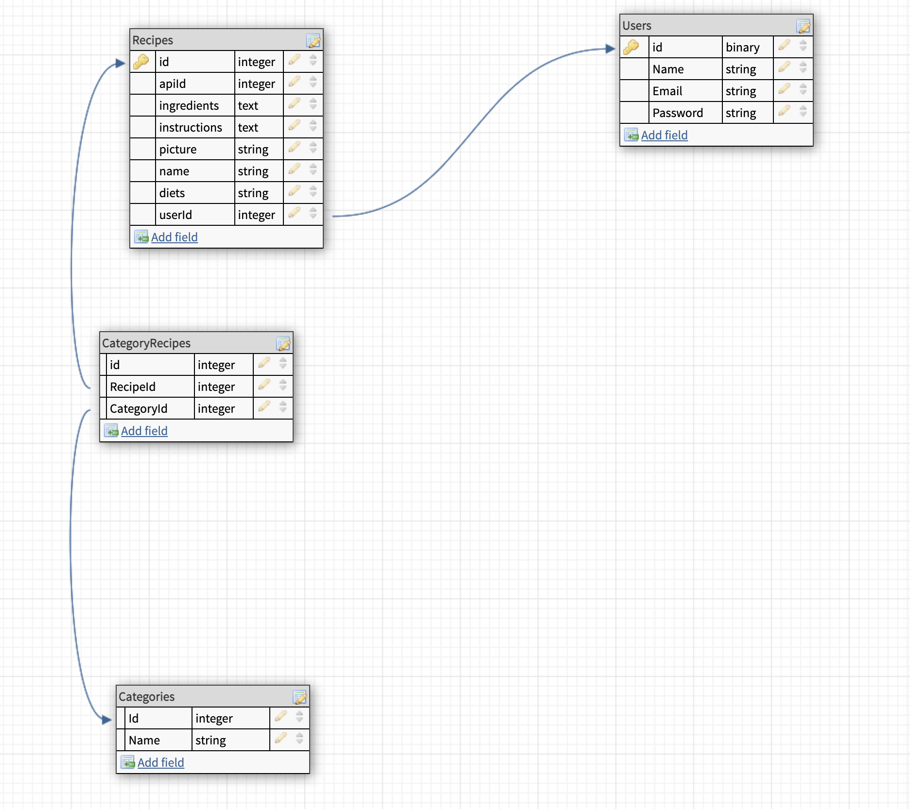

# Your_recipes

### Overview

This project is a recipe app that allows the user to look for recipes, save them in weekly meal plans, divide them in categories such as breakfast, lunch, snack, dinner and etc, and eventually get a grocery list based on the list of the ingredients of each meal.

### Wireframe

 

### User Stories

-When I first visit the site, I'm on a home page that just has a simple description of the app.

-When not logged in, I see links to home, signup & login only, where I can create an account or login. If I were to visit any of these routes manually while logged in, I would get redirected to the home page.

-When logged in, in navigation bar, I see links to User,search for recipe, add recipe, and weekly plan

-The Navigation Bar will stay the same after the login till I logout

-The user name can be clicked and will open up a menu where I can logout, navigate to the categories or navigate to all the recipes page.

-If I'm in "All the recipe" page I can click on one recipe I will navigate to the single recipe page

-In the User page I can see all the recipes organized by categories.

-In the top right corner in the category section I will have a + button to create a category.

-The category has a + button that will bring me to a page with all the recipes from Where I will be able to add them to the selected  category.

-If I click on the single recipe in the category section or in "all recipes Page", the app will bring me to the single recipe page.

-The single recipe page shows the list of the ingredients, the image and the instructions for the recipe., and the options of add it to a category by selecting it from a drop down menu.

-From the navigation bar I can click the search button.

-The search button opens a drop down menu with links to 3 different type of search, by name by ingredients and by calories.

-All the links brings to 3 different pages built in the same way with just the search input different.

-The search input will send a call to the api.

-After the call, a list of results(recipes) will be shown in the same page, and the user can decide to add it to one or more categories.

<!-- -When add to category the user will create a row in the recipes table in the backend and an association between the recipes table and categories table.  -->

-Once added to the categories, the recipe will be shown in the user page under the relative category.

-The user can remove it by clicking the remove button.

-From the Navigation Bar I can click add Recipe that will show a drop down menu with two links, 1 to add from website and 1 add by typing in.

-If I click add from website I will navigate to a different page where I can see an input and a button. After I paste the link into the input and I click search, I will make an Api call and the api will try to read the info from the website.

-If I have a successful call I will see picture, ingredients and instructions for the recipe

-The user can modify the informations by clicking, modify.

-If I decide that I like it I can select the category and I can click add and I will create a recipe in the database.

-If I choose to add a recipe manually, I will navigate to a page where I can type the different ingredients and the instructions. Once I think I like it I can added to the a category.

### Routes

|Routes                     | HTTP Verb                       | URL                            |
| :----------------------: | ------------------------------- | ------------------------------- |
| userRoute | .post | 'user/' |
| userRoute | .post | 'user/login' |
| userRoute | .get | 'user/verify' |
| recipeRoute | .post | '/recipe/:userId' |
| recipeRoute | .get | '/recipe/all/:userId' |
| recipeRoute | .get | '/recipe/:recipeId' |
| recipeRoute | .put | '/recipe/:recipeId' |
| recipeRoute | .delete | '/recipe/:recipeId' |
| categoryRoute | .get | '/category/:categoryId' |
| categoryRoute | .get | '/category/all/:userId' |
| categoryRoute | .get | '/category/:categoryId/recipes' |
| categoryRoute | .post | '/category/:userId' |
| categoryRoute | .put | '/category/:categoryId/:recipeId' |
| categoryRoute | .delete | '/category/:categoryId/:recipeId' |
| categoryRoute | .delete | '/category/:categoryId' |
___
### MVP

-The site has user authentication functionality. 

-Each user can add and remove recipes by searching them from the api. 

-Each user has recipes saved and organized in categories.

-Each user can add or remove the recipes to categories

-The app has a clean modern style.

### Stretch Goals

-Add the feature of add recipe from a website
-add the feature of add recipe by just typing them in a form
-Create a weekly meal plan
-Create a grocery list based on the weekly plan

### Completion Timeline:

- By the end of Monday I will have the backend completed with the  tables and routes functions,

- Then Moving on the Frontend I will start on the user authentication first, then going with the app flow:

- Add the functions to search for the recipes and the components related to them

- Adding the functions to add recipes, add categories, create the associations between the two,

### Links

- frontend:

https://github.com/Marcolux/Recipe

- backend:

https://github.com/Marcolux/Recipe_backend

Unit 4 Solo-Project